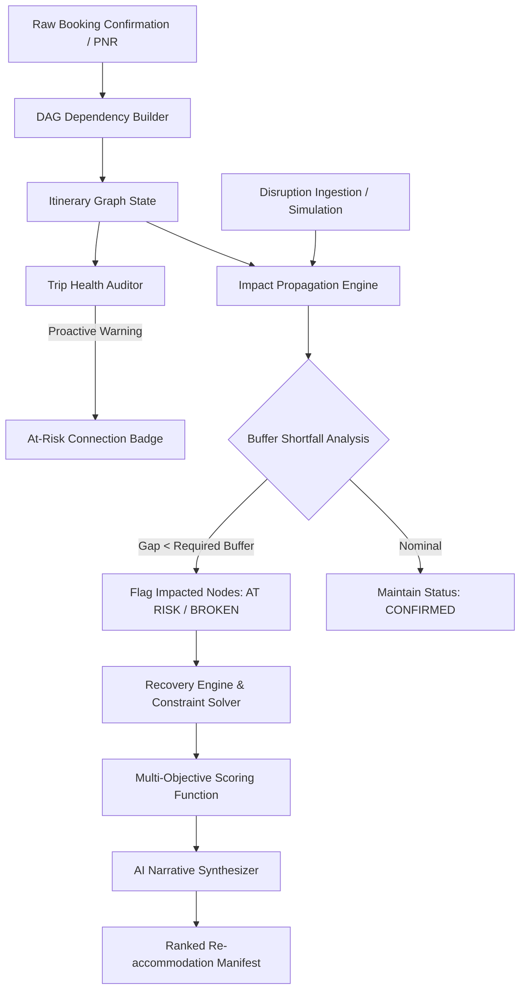

<div align="center">

  

  # **planB**
  ### *Real-time Travel Disruption & Autonomous Re-accommodation Engine*

  [](https://react.dev/)
  [](https://www.typescriptlang.org/)
  [](https://vitejs.dev/)
  [](https://tailwindcss.com/)
  [](LICENSE)
  [](https://vercel.com)

  <p align="center">
    <strong>planB</strong> turns fragmented travel itineraries into reactive dependency graphs. When a single flight delays or a train is cancelled, planB calculates downstream ripple effects in milliseconds and synthesizes ranked, AI-reasoned recovery plans before you ever get stranded.
  </p>

  <p align="center">
    <a href="#-key-features">Key Features</a> •
    <a href="#-the-ripple-problem">The Ripple Problem</a> •
    <a href="#-architecture--pipeline">Architecture</a> •
    <a href="#-mathematical-scoring-model">Scoring Model</a> •
    <a href="#-getting-started">Getting Started</a> •
    <a href="#-project-structure">Project Structure</a>
  </p>

</div>

---

## 🧭 The Ripple Problem

Modern travel is booked across siloed platforms: an airline ticket on Delta, a train on SNCF, a hotel on Booking.com, and an excursion on Viator. None of these systems talk to each other.

```
[ ✈️ Flight Delayed +90m ]
          │
          ▼
[ ❌ Missed High-Speed Rail Transfer ] ──► (Buffer: -45 min shortfall)
          │
          ▼
[ ⚠️ Late Hotel Check-in Invalidation ]
          │
          ▼
[ 🚫 Cancelled Excursion & Sunk Costs ]
```

When **Flight Leg 1** slips by 90 minutes, it is not an isolated delay — it triggers a **cascading multi-modal failure**. Travelers and customer support agents are forced to manually scramble across multiple apps to calculate connection buffers and find alternatives.

**planB** models travel as a **Directed Acyclic Graph (DAG)** with strict buffer invariants. When any disruption occurs, planB propagates the delay forward, pinpoints every broken leg, and solves for the optimal recovery itinerary in real time.

---

## ✨ Key Features

| Capability | Description |
| :--- | :--- |
| **🔄 DAG Topological Engine** | Reconstructs multi-leg trips into dependency graphs with parameterized buffer margins (immigration, transit, baggage claim). |
| **⚡ Real-Time Ripple Detection** | Evaluates downstream buffer shortfalls instantaneously and marks impacted legs as `AT RISK` or `BROKEN`. |
| **🎯 Multi-Criteria Heuristic Ranking** | Scores replacement options using a weighted composite model factoring itinerary survivability, cost delta, and time delta. |
| **🤖 Context-Aware AI Reasoning** | Generates transparent operational rationale explaining why Option A is superior to Option B under real-world constraints. |
| **📋 Flight Manifest Design System** | High-density operational interface featuring airport departure flip animations, status badges, and zero-fluff layout. |
| **🛡️ Proactive Risk Auditing** | Evaluates pre-departure itinerary health, flagging dangerously tight buffers (e.g., < 45 min international connections). |
| **📥 Raw PNR & Confirmation Parser** | Ingests unformatted confirmation text, flight numbers, and booking emails into structured, validated itinerary DAGs. |

---

## 🏗️ Architecture & Pipeline



### Core Engine Breakdown (`src/`)

- **`src/types.ts`**: Strict data definitions for `Booking`, `Location`, `Disruption`, `ImpactedBooking`, `RecoveryOption`, and `ScoredRecoveryOption`.
- **`src/impactEngine.ts`**: Graph traversal and buffer propagation algorithm. Detects direct and indirect downstream impacts when any node experiences delays or cancellations.
- **`src/recoveryEngine.ts`**: Constraint-solving engine that evaluates candidate replacement bookings, computes cost/time deltas, calculates composite scores, and formats AI prompts.
- **`src/seedData.ts`**: Trans-continental multi-modal test itineraries (e.g., London ✈️ Paris 🚄 Lyon, Tokyo ✈️ Osaka 🚄 Kyoto).
- **`src/demo.ts`**: Standalone CLI simulation demonstrating graph impact detection and recovery ranking.

---

## 🧮 Mathematical Scoring Model

When multiple recovery options exist, **planB** computes a normalized **Composite Recovery Score** ($S_{\text{composite}} \in [0, 100]$):

$$S_{\text{composite}} = w_{\text{itin}} \cdot S_{\text{itinerary}} + w_{\text{cost}} \cdot S_{\text{cost}} + w_{\text{time}} \cdot S_{\text{time}}$$

Where:
- **$S_{\text{itinerary}}$** (Weight $w_{\text{itin}} = 0.50$): Downstream survivability percentage. Evaluates how many subsequent bookings remain intact without secondary disruptions.
- **$S_{\text{cost}}$** (Weight $w_{\text{cost}} = 0.25$): Normalized cost variance against the original booking price:
  $$S_{\text{cost}} = \max\left(0, 100 - \frac{|\Delta \text{Cost}|}{\text{Cost}_{\text{original}}} \times 50\right)$$
- **$S_{\text{time}}$** (Weight $w_{\text{time}} = 0.25$): Arrival time penalty based on delay magnitude:
  $$S_{\text{time}} = \max\left(0, 100 - \frac{\Delta \text{Time}_{\text{minutes}}}{180} \times 100\right)$$

### Buffer Constraint Invariant

A booking $B_j$ depending on $B_i$ is valid if and only if:

$$\text{StartTime}(B_j) - \text{EndTime}(B_i) \ge \text{BufferMinutes}(B_j)$$

If $\text{StartTime}(B_j) - \text{EndTime}(B_i) < \text{BufferMinutes}(B_j)$, the shortfall is calculated as:

$$\text{Shortfall} = \text{BufferMinutes}(B_j) - \left(\text{StartTime}(B_j) - \text{EndTime}(B_i)\right)$$

---

## 🚀 Getting Started

### Prerequisites

- **Node.js**: v18.0.0 or higher
- **npm** or **pnpm**

### Installation

```bash
# Clone the repository
git clone https://github.com/HanSolo456/planB.git
cd planB

# Install dependencies for root and web client
npm install
```

### Running the Web Application

```bash
# Start the Vite local development server
npm run dev
```

The application will be accessible at `http://localhost:5173`.

### Running the CLI Engine Demo

To test the graph propagation and recovery solver directly in your terminal:

```bash
npm run demo
```

---

## 📁 Project Structure

```
planB/
├── src/                          # Core TypeScript Algorithmic Engines
│   ├── types.ts                  # Schema & Data Models
│   ├── impactEngine.ts           # DAG Traversal & Buffer Shortfall Detection
│   ├── recoveryEngine.ts         # Multi-Criteria Recovery Solver & Scorer
│   ├── seedData.ts               # Multi-Modal Test Scenarios
│   └── demo.ts                   # Interactive CLI Demonstration Script
│
├── ripple-app/                   # React 19 + Vite Web Application
│   ├── public/
│   │   ├── planb-logo.svg        # Official planB Vector Logo
│   │   └── favicon.svg           # Manifest Favicon
│   ├── src/
│   │   ├── components/
│   │   │   ├── PlanBLogo.tsx     # Vector Brand Component
│   │   │   ├── Header.tsx        # Ops Manifest Header & Status Pill
│   │   │   ├── LandingPage.tsx   # Zero-Auth Entry Screen
│   │   │   ├── ItineraryView.tsx # DAG Segment Visualizer & Timeline
│   │   │   ├── BookingCard.tsx   # Manifest Segment Card with Buffer Indicators
│   │   │   ├── RecoveryView.tsx  # Scored Alternative Matrix & AI Reasoning
│   │   │   ├── DisruptionTrigger.tsx # Simulation Control Panel
│   │   │   ├── TripRiskBadge.tsx # Pre-Departure Buffer Audit Badge
│   │   │   └── ImportView.tsx    # Raw PNR / Confirmation Text Parser
│   │   ├── App.tsx               # Root State Machine & Context Provider
│   │   └── index.css             # Flight Manifest Design Tokens
│   └── package.json
│
├── package.json                  # Root Monorepo Scripts
└── README.md                     # Documentation
```

---

## 🎨 Design System: The Flight Manifest Aesthetic

**planB** adopts a purposeful, high-contrast operational aesthetic inspired by flight dispatch manifests and departure boards:

```css
:root {
  /* Surface & Base */
  --color-bg-base:        #F7F5F1;   /* Warm technical paper */
  --color-bg-surface:     #FFFFFF;   /* Clean manifest white */
  --color-border:         #DEDAD2;   /* Restrained grid border */
  
  /* Status Palette */
  --color-confirmed:      #2B5D5C;   /* Deep Aviation Teal */
  --color-at-risk:        #B8552F;   /* Warning Amber */
  --color-disrupted:      #9E2B25;   /* Critical Brick Red */
}
```

- **Typography**: `Fraunces` (Editorial Display), `IBM Plex Mono` (Tabular Data & Timestamps), `IBM Plex Sans` (Body).
- **Interactions**: Subtle `180ms` departure board flip transitions on status updates.

---

## 🛡️ License

Distributed under the **MIT License**. See `LICENSE` for more information.

<div align="center">
  <sub>Built with precision for travelers, dispatchers, and autonomous travel recovery.</sub>
</div>
