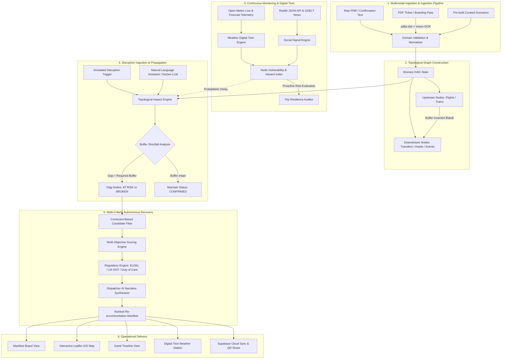

<div align="center">

  

  # **planB**
  ### *Real-time Travel Disruption & Autonomous Re-accommodation Engine*

  [](https://react.dev/)
  [](https://www.typescriptlang.org/)
  [](https://vitejs.dev/)
  [](https://tailwindcss.com/)
  [](https://supabase.com/)
  [](https://leafletjs.com/)
  [](https://groq.com/)
  [](LICENSE)

  <p align="center">
    <strong>planB</strong> transforms fragmented travel itineraries into reactive, self-healing dependency graphs (DAGs). Powered by a real-time weather digital twin, social ground-truth ingestion, and domain-aligned aviation intelligence, planB detects downstream ripple effects in milliseconds and synthesizes ranked, legally informed re-accommodation solutions before passengers get stranded.
  </p>

  <p align="center">
    <a href="#-the-ripple-problem">The Ripple Problem</a> •
    <a href="#-key-features">Key Features</a> •
    <a href="#-system-architecture">Architecture</a> •
    <a href="#-mathematical-models">Mathematical Models</a> •
    <a href="#-operational-manifest-views">Interface Views</a> •
    <a href="#-aviation-regulatory-intelligence">Regulatory Engine</a> •
    <a href="#-getting-started">Getting Started</a> •
    <a href="#-project-structure">Project Structure</a>
  </p>

</div>

---

## 🧭 The Ripple Problem

Modern travel is booked across siloed platforms: an airline ticket on Delta or British Airways, a high-speed train on SNCF or Eurostar, a hotel on Booking.com, and an excursion on Viator. **None of these systems communicate with each other.**

```
[ ✈️ Flight Leg 1: DEL → LHR Delayed +110m ]
                     │
                     ▼
[ ❌ Missed Eurostar Train Transfer ] ─────────► (Buffer: -50 min shortfall)
                     │
                     ▼
[ ⚠️ Late Hotel Check-in Invalidation ] ──────► (Automatic no-show cancellation)
                     │
                     ▼
[ 🚫 Forfeited Pre-paid Activity & Sunk Cost ] ─► (100% financial penalty)
```

When an upstream flight slips by 90 minutes, it is never an isolated operational metric — it triggers a **cascading multi-modal failure**. Travelers and dispatch agents are left to scramble manually across disjointed apps, recalculate minimum connection times (MCT), and guess which rebooking preserves their downstream schedule.

**planB** models the entire travel journey as a **Directed Acyclic Graph (DAG)** governed by strict temporal buffer invariants. When any disruption occurs (or is forecasted by weather anomalies), planB propagates the delay forward, pinpoints every compromised downstream node, and computes Pareto-optimal recovery alternatives in real time.

---

## ✨ Key Features

| Domain | Capability | Description |
| :--- | :--- | :--- |
| **🔄 Graph Engine** | **Topological DAG Propagation** | Reconstructs multi-leg trips into dependency graphs with parameterized buffer margins (immigration, terminal transit, baggage claim). |
| **🌦️ Digital Twin** | **Weather & Hazard Modeling** | Integrates live Open-Meteo telemetry (METAR, convective precipitation, wind gusts, ceiling, visibility) to forecast node vulnerability. |
| **📡 Ground Signals** | **Social & News Intelligence** | Fetches live Reddit community discussions and GDELT news feeds at transit hubs to detect strikes, road closures, and localized flooding. |
| **🗺️ Geospatial GIS** | **Interactive Map View** | Leaflet-powered GIS route visualization with color-coded node health, transit arcs, and real-time weather radar markers. |
| **⏱️ Chronometry** | **Multi-Modal Timeline (Gantt)** | Dynamic Gantt visualization displaying connection buffers, visual shortfall warnings, and cascading delay shift indicators. |
| **🤖 AI Copilot** | **IROPS Disruption Assistant** | Conversational terminal powered by Groq and NuGen travel-aligned models to simulate "What if...?" scenarios via natural language. |
| **⚖️ Compliance** | **Aviation Regulatory Engine** | Evaluates EU261 / UK261 compensation eligibility (€250–€600), US DOT 14 CFR Part 260 cash refund rights, and duty-of-care lodging. |
| **🎯 Multi-Objective** | **Heuristic Recovery Solver** | Ranks alternative bookings using a weighted composite score factoring itinerary survivability, cost delta, and arrival time variance. |
| **🛡️ Proactive Audit** | **Non-Linear Trip Risk Gauge** | Proactively scores pre-departure itinerary health, flagging tight connections with diminishing-returns penalty calibration. |
| **📥 Multimodal Ingestion** | **PDF, OCR & PNR Parser** | Ingests airline confirmation emails, raw PNR strings, or uploaded PDF/image tickets via `pdfjs-dist` and Vision LLMs. |
| **☁️ Sync & Sharing** | **Supabase Persistence & QR** | Cloud database sync for trips with instant tokenized public sharing links and scannable passenger boarding QR codes. |
| **🎨 Manifest UI** | **High-Density Flight Board** | Editorial dispatch aesthetic featuring tabular data typography, departure board flip animations, and Lenis smooth scrolling. |

---

## 🏗️ System Architecture


```mermaid
flowchart TD
    subgraph Ingestion ["1. Multimodal Ingestion & Ingestion Pipeline"]
        A1[Raw PNR / Confirmation Text] --> B[Domain Validation & Normalizer]
        A2[PDF Ticket / Boarding Pass] -->|pdfjs-dist + Vision OCR| B
        A3[Pre-built Curated Scenarios] --> B
    end

    subgraph StateGraph ["2. Topological Graph Construction"]
        B --> C[Itinerary DAG State]
        C --> D1[Upstream Nodes: Flights / Trains]
        C --> D2[Downstream Nodes: Transfers / Hotels / Events]
        D1 -->|Buffer Invariant $\tau$| D2
    end

    subgraph Monitoring ["3. Continuous Monitoring & Digital Twin"]
        E1[Open-Meteo Live & Forecast Telemetry] --> F[Weather Digital Twin Engine]
        E2[Reddit JSON API & GDELT News] --> G[Social Signal Engine]
        F & G --> H[Node Vulnerability & Hazard Index]
        H -->|Proactive Risk Evaluation| I[Trip Resilience Auditor]
    end

    subgraph Disruption ["4. Disruption Ingestion & Propagation"]
        J1[Simulated Disruption Trigger] --> K[Topological Impact Engine]
        J2[Natural Language Assistant / NuGen LLM] --> K
        H -.->|Probabilistic Delay| K
        C --> K
        K --> L{Buffer Shortfall Analysis}
        L -->|Gap < Required Buffer| M[Flag Nodes: AT RISK or BROKEN]
        L -->|Buffer Intact| N[Maintain Status: CONFIRMED]
    end

    subgraph Recovery ["5. Multi-Criteria Autonomous Recovery"]
        M --> O[Constraint-Based Candidate Filter]
        O --> P[Multi-Objective Scoring Engine]
        P --> Q[Regulatory Engine: EU261 / US DOT / Duty of Care]
        Q --> R[Dispatcher AI Narrative Synthesizer]
        R --> S[Ranked Re-accommodation Manifest]
    end

    subgraph Presentation ["6. Operational Delivery"]
        S --> T1[Manifest Board View]
        S --> T2[Interactive Leaflet GIS Map]
        S --> T3[Gantt Timeline View]
        S --> T4[Digital Twin Weather Station]
        S --> T5[Supabase Cloud Sync & QR Share]
    end
```

### Core Engine Modules

- **`src/impactEngine.ts` / `ripple-app/src/lib/impactEngine.ts`**: Implements topological BFS graph traversal. Propagates delay minutes through dependency chains, computes exact buffer shortfalls, and recalculates downstream effective start/end times.
- **`ripple-app/src/lib/weatherEngine.ts`**: Interfaces with Open-Meteo APIs to calculate aviation weather severity (0–4 scale), airport crosswind components, low-ceiling visibility hazards, and downstream trip impact probabilities.
- **`ripple-app/src/lib/socialSignalEngine.ts`**: Connects to public Reddit endpoints and GDELT news feeds to extract on-the-ground sentiment and transit crisis reports.
- **`src/recoveryEngine.ts` / `ripple-app/src/lib/recoveryEngine.ts`**: Constraint-solving engine that evaluates candidate replacement bookings, computes cost/time deltas, calculates composite scores, and validates schedule continuity.
- **`ripple-app/src/lib/reasoningEngine.ts`**: Generates grounded, natural-language dispatcher rationales using Groq models to explain why a specific recovery alternative is optimal.
- **`ripple-app/src/lib/nugenDisruptionEngine.ts`**: Travel-domain aligned model integration utilizing NuGen alignment architecture for structured IROPS extraction.
- **`ripple-app/src/lib/fileImportEngine.ts`**: Handles client-side PDF rendering via HTML5 canvas and calls Vision LLMs for tabular ticket and receipt extraction.
- **`ripple-app/src/lib/cloudTripStorage.ts`**: Manages cloud persistence, user session trips, and tokenized sharing via Supabase.

---

## 🧮 Mathematical Models

### 1. Buffer Constraint Invariant & Shortfall

For any directed edge $B_i \to B_j$ in the itinerary graph, where $B_j$ depends on the completion of $B_i$:

$$\text{Actual Gap}(B_i, B_j) = \text{StartTime}(B_j) - \text{EndTime}(B_i)$$

The invariant condition requires that the actual gap satisfies the minimum operational transit buffer $\tau_{\text{buffer}}(B_j)$ (accounting for immigration, baggage claim, or inter-terminal transit):

$$\text{Actual Gap}(B_i, B_j) \ge \tau_{\text{buffer}}(B_j)$$

When upstream node $B_i$ incurs an effective delay $\Delta_{\text{delay}}$, the post-disruption gap becomes:

$$\text{Actual Gap}'(B_i, B_j) = \text{StartTime}(B_j) - \left(\text{EndTime}(B_i) + \Delta_{\text{delay}}\right)$$

If $\text{Actual Gap}' < \tau_{\text{buffer}}(B_j)$, node $B_j$ is marked **AT RISK** or **BROKEN**, with shortfall:

$$\text{Shortfall}(B_j) = \tau_{\text{buffer}}(B_j) - \text{Actual Gap}'(B_i, B_j)$$

---

### 2. Composite Recovery Score ($S_{\text{composite}}$)

When multiple candidate recovery itineraries exist, planB computes a normalized **Composite Recovery Score** ($S_{\text{composite}} \in [0, 100]$):

$$S_{\text{composite}} = w_{\text{itin}} \cdot S_{\text{itinerary}} + w_{\text{cost}} \cdot S_{\text{cost}} + w_{\text{time}} \cdot S_{\text{time}}$$

Where default weights are calibrated for passenger convenience and trip preservation:
- **$w_{\text{itin}} = 0.50$**: Downstream itinerary survivability weight.
- **$w_{\text{cost}} = 0.25$**: Cost variance sensitivity weight.
- **$w_{\text{time}} = 0.25$**: Arrival delay sensitivity weight.

#### Component Formulations:

1. **Downstream Survivability ($S_{\text{itinerary}}$)**:
   $$S_{\text{itinerary}} = \frac{N_{\text{preserved}}}{N_{\text{downstream}}} \times 100$$
   Where $N_{\text{preserved}}$ is the number of subsequent bookings whose buffer invariants remain intact without secondary rebooking.

2. **Cost Delta Score ($S_{\text{cost}}$)**:
   $$S_{\text{cost}} = \max\left(0, 100 - \frac{|\Delta \text{Cost}|}{\text{Cost}_{\text{original}}} \times 50\right)$$
   If the recovery option is cheaper or equal ($\Delta \text{Cost} \le 0$), $S_{\text{cost}} = 100$.

3. **Time Delta Score ($S_{\text{time}}$)**:
   $$S_{\text{time}} = \max\left(0, 100 - \frac{\Delta \text{Time}_{\text{minutes}}}{180} \times 100\right)$$
   A delay of 3 hours (180 minutes) or more reduces the time score to 0.

---

### 3. Non-Linear Trip Resilience Score ($S_{\text{risk}}$)

To prevent multiple minor buffer compressions from falsely registering as a catastrophic itinerary failure, planB employs a **rank-ordered non-linear diminishing returns** risk scoring function:

$$S_{\text{risk}} = \max\left(0, 100 - \sum_{k=1}^{M} \gamma_k \cdot P_k - P_{\text{disruptions}}\right)$$

Where:
- $P_k$ represents the raw risk penalty of the $k$-th connection sorted in descending order of severity.
- $\gamma_k$ is the diminishing returns decay factor:
  $$\gamma = [1.00,\, 0.75,\, 0.50,\, 0.35,\, 0.25]$$
  *(The single worst vulnerability receives 100% penalty weighting, the second worst receives 75%, and subsequent connections taper to 25%).*

#### Base Penalty Allocation ($P_k$):
- **Critical Shortfall**: $20 + \min(20, \text{Shortfall}_{\text{minutes}})$ pts.
- **Zero Slack** (Window matches buffer exactly): $28$ pts.
- **Moderate Slack** (1–15 min surplus margin): $20$ pts.
- **Comfortable Slack** (16–30 min surplus margin): $14$ pts.

#### Resilience Tiers:
- 🟢 **Low Risk**: $S_{\text{risk}} \ge 75$ (Schedule contains robust transfer cushions).
- 🟡 **Moderate Risk**: $40 \le S_{\text{risk}} < 75$ (Vulnerable to standard ATC ground holds).
- 🔴 **High Risk**: $S_{\text{risk}} < 40$ (Schedule has razor-thin or broken connections).

---

## 🖥️ Operational Manifest Views

planB provides four synchronized views tailored for dispatchers and travelers:

```
┌──────────────────────────────────────────────────────────────────────────────┐
│  [ MANIFEST BOARD ]   [ INTERACTIVE MAP ]   [ TIMELINE ]   [ DIGITAL TWIN ]  │
└──────────────────────────────────────────────────────────────────────────────┘
```

### 1. Flight Manifest Board (`ManifestView`)
- High-density tabular layout reminiscent of airport flight dispatch operations.
- Real-time buffer status indicators (`CONFIRMED`, `AT RISK`, `BROKEN`).
- Departure board flip counter displaying affected passenger counts and schedule shift deltas.
- Inline recovery drawer with scored alternatives and one-click re-accommodation application.

### 2. Interactive Geospatial Map (`MapView`)
- Built on Leaflet with custom styled dark/light tile layers.
- Geo-referenced airport and transit nodes with Great-Circle arc paths.
- Interactive node markers that pulse amber or red when impacted.
- Weather radar overlay displaying real-time cloud cover, precipitation, and storm vectors.

### 3. Multi-Modal Timeline (`TimelineView`)
- Chronological Gantt chart plotting every journey segment on a continuous time axis.
- Visual connection blocks showing exact layover minutes vs. required minimum buffer.
- Red diagonal hash marks displaying buffer shortfall erosion during cascading delays.
- Ghost overlays comparing original scheduled times against projected delayed arrivals.

### 4. Weather Digital Twin (`DigitalTwinView`)
- Live meteorological telemetry across all itinerary waypoints from Open-Meteo.
- Airport operational status gauges: Crosswinds, Visibility, Convective Activity.
- Integrated Social & News Signal radar tracking local traveler sentiment and ground updates.
- "Simulate Storm" sandbox to model the downstream cascade of severe weather before departure.

---

## ⚖️ Aviation Regulatory Intelligence

When disruptions happen, recovery is not merely a geometric routing problem — it is governed by international passenger rights. planB automatically computes compensation entitlements:

| Regulatory Body | Threshold / Conditions | Mandatory Passenger Entitlements |
| :--- | :--- | :--- |
| **EU261 / UK261** | Delay $\ge 3\text{h}$ at final destination (Carrier-caused) | **€250** (flights $< 1,500\text{km}$)<br>**€400** (flights $1,500\text{–}3,500\text{km}$)<br>**€600** (flights $> 3,500\text{km}$) |
| **US DOT (14 CFR Part 260)** | Significant schedule change ($\ge 3\text{h}$ domestic, $\ge 6\text{h}$ intl) | **Mandatory full cash refund** within 7 business days (airline vouchers cannot be forced). |
| **Duty of Care (Global)** | Involuntary overnight delay / missed connection | **Free hotel accommodation**, airport ground transfers, and meal/refreshment vouchers. |
| **DGCA (India)** | Flight cancelled $< 24\text{h}$ before departure | Re-booking on alternative flight or **full refund + compensation** up to ₹10,000 depending on block time. |

---

## 🚀 Getting Started

### Prerequisites

- **Node.js**: v18.0.0 or higher
- **npm** (v9+) or **pnpm**

### Installation

```bash
# Clone the repository
git clone https://github.com/HanSolo456/planB.git
cd planB

# Install root and web client dependencies
npm install
```

### Environment Configuration

Create a `.env.local` file inside the `ripple-app/` directory:

```bash
cp ripple-app/.env.example ripple-app/.env.local
```

Configure your environment keys:

```ini
# Optional: Groq API Key for NLP extraction & dispatcher reasoning
VITE_GROQ_API_KEY=gsk_your_groq_api_key_here

# Optional: Supabase for persistent trip storage and public sharing
VITE_SUPABASE_URL=https://your-project-id.supabase.co
VITE_SUPABASE_ANON_KEY=your-anon-key-here
```

*(Note: planB functions completely in zero-auth local mode with pre-loaded mock scenarios if API keys are omitted!)*

### Running the Web Application

```bash
# Start the Vite local development server
npm run dev
```

Open your browser at `http://localhost:5173`.

### Running the CLI Engine Demo

To execute the standalone algorithmic graph propagation and recovery solver in your terminal:

```bash
npm run demo
```

---

## 📁 Project Structure

```
planB/
├── src/                                  # Core TypeScript Algorithmic Engines
│   ├── types.ts                          # Strict Data Models & Graph Types
│   ├── impactEngine.ts                   # DAG Traversal & Buffer Shortfall Detection
│   ├── recoveryEngine.ts                 # Multi-Criteria Recovery Solver & Scorer
│   ├── seedData.ts                       # Multi-Modal Test Scenarios
│   └── demo.ts                           # Standalone CLI Demonstration Script
│
├── nugen-alignment/                      # NuGen Domain Intelligence & Ontologies
│   ├── 01_travel_disruption_ontology...  # IROPS Recovery & Buffer Benchmarks
│   ├── 02_aviation_regulations...        # EU261, US DOT & Duty of Care Rules
│   ├── 03_itinerary_graph_ripple...      # DAG Mathematical Propagation Theory
│   ├── benchmark_questions.json          # Domain Evaluation Benchmark Suite
│   └── planB_travel_disruption_master... # Master Prompt Training Corpus
│
├── ripple-app/                           # React 19 + TypeScript + Vite Application
│   ├── public/
│   │   ├── planb-logo.svg                # Official Vector Logo
│   │   ├── favicon.svg                   # Browser Favicon
│   │   └── *.png / *.jpg                 # Destination & Architectural Imagery
│   │
│   ├── src/
│   │   ├── components/                   # UI Component System
│   │   │   ├── Header.tsx                # Ops Manifest Header & Status Badges
│   │   │   ├── LandingPage.tsx           # Entry Screen & Scenario Launcher
│   │   │   ├── TripDashboard.tsx         # Main Operational Control Deck
│   │   │   ├── BookingCard.tsx           # Manifest Segment Card with Buffer shortfalls
│   │   │   ├── MapView.tsx               # Leaflet GIS Route Visualizer
│   │   │   ├── TimelineView.tsx          # Chronological Multi-Modal Gantt Chart
│   │   │   ├── DigitalTwinView.tsx       # Meteorological Digital Twin Station
│   │   │   ├── WeatherMapOverlay.tsx     # Live Weather Map Markers & Radar
│   │   │   ├── RecoveryView.tsx          # Scored Alternatives & Re-accommodation
│   │   │   ├── DisruptionAssistant.tsx   # Conversational Natural Language Ops Terminal
│   │   │   ├── DisruptionTrigger.tsx     # Disruption Simulation Drawer
│   │   │   ├── TripRiskBadge.tsx         # Non-Linear Risk Score Console Gauge
│   │   │   ├── ResilienceAuditModal.tsx  # Pre-Departure Vulnerability Audit Modal
│   │   │   ├── ImportView.tsx            # Multi-Format PNR / File / Text Importer
│   │   │   ├── SharedTripView.tsx        # Public Shared Itinerary View
│   │   │   ├── GradualBlur.tsx           # Aesthetic Gradual Blur Viewport Mask
│   │   │   └── CustomCursor.tsx          # Smooth Interactive Operational Pointer
│   │   │
│   │   ├── lib/                          # Web Client Engine Services
│   │   │   ├── types.ts                  # Shared Interface Schemas
│   │   │   ├── impactEngine.ts           # Client Graph Propagation & Risk Scorer
│   │   │   ├── recoveryEngine.ts         # Client Recovery Candidate Evaluator
│   │   │   ├── weatherEngine.ts          # Open-Meteo Live Telemetry Integration
│   │   │   ├── socialSignalEngine.ts     # Reddit & GDELT Ground Truth Feeds
│   │   │   ├── nugenDisruptionEngine.ts  # NuGen Domain Model Integration
│   │   │   ├── nlDisruptionEngine.ts     # Natural Language Disruption Parsing
│   │   │   ├── reasoningEngine.ts        # Groq-powered AI Dispatcher Notes
│   │   │   ├── fileImportEngine.ts       # PDF.js Canvas + Vision OCR Engine
│   │   │   ├── importEngine.ts           # PNR & Raw Text Extraction Parser
│   │   │   ├── cloudTripStorage.ts       # Supabase Cloud Database Client
│   │   │   └── seedData.ts               # Multi-Modal Curated Trips (Goa, London, etc.)
│   │   │
│   │   ├── App.tsx                       # Root Route & Application State Manager
│   │   └── index.css                     # Flight Manifest Design Tokens & Styling
│   │
│   ├── package.json                      # Web App Dependencies & Scripts
│   └── vite.config.ts                    # Vite Bundler & Proxy Configuration
│
├── package.json                          # Monorepo Scripts
└── README.md                             # Global Documentation
```

---

## 🎨 Design System: The Flight Manifest Aesthetic

**planB** rejects generic dashboard templates in favor of a purposeful, high-contrast operational aesthetic inspired by flight dispatch consoles, airport split-flap departure boards, and technical manifests:

```css
:root {
  /* Surface & Base */
  --color-bg-base:        #F7F5F1;   /* Warm technical paper */
  --color-bg-surface:     #FFFFFF;   /* Clean manifest white */
  --color-border:         #DEDAD2;   /* Restrained architectural grid border */
  
  /* Operational Status Palette */
  --color-confirmed:      #2B5D5C;   /* Deep Aviation Teal */
  --color-confirmed-bg:   #EDF5F4;
  --color-at-risk:        #E08A3C;   /* Warning Amber */
  --color-at-risk-bg:     #FBF0E4;
  --color-disrupted:      #9E2B25;   /* Critical Brick Red */
  --color-disrupted-bg:   #FBEAE9;
}
```

- **Typography**:
  - `Fraunces`: High-contrast editorial display serif for trip headers and milestones.
  - `IBM Plex Mono`: Tabular numbers, gate identifiers, flight codes, and UTC timestamps.
  - `IBM Plex Sans`: Legible, clean sans-serif for operational body notes.
- **Micro-Interactions**:
  - Split-flap departure board 180ms animations on schedule updates.
  - Lenis smooth momentum scrolling.
  - Dynamic blur masks (`GradualBlur`) over scrolling tables and sticky navigation headers.

---

## 🛡️ License

Distributed under the **MIT License**. See [`LICENSE`](LICENSE) for complete details.

<div align="center">
  <sub>planB — Engineered with precision for autonomous travel recovery, operational resilience, and passenger peace of mind.</sub>
</div>
